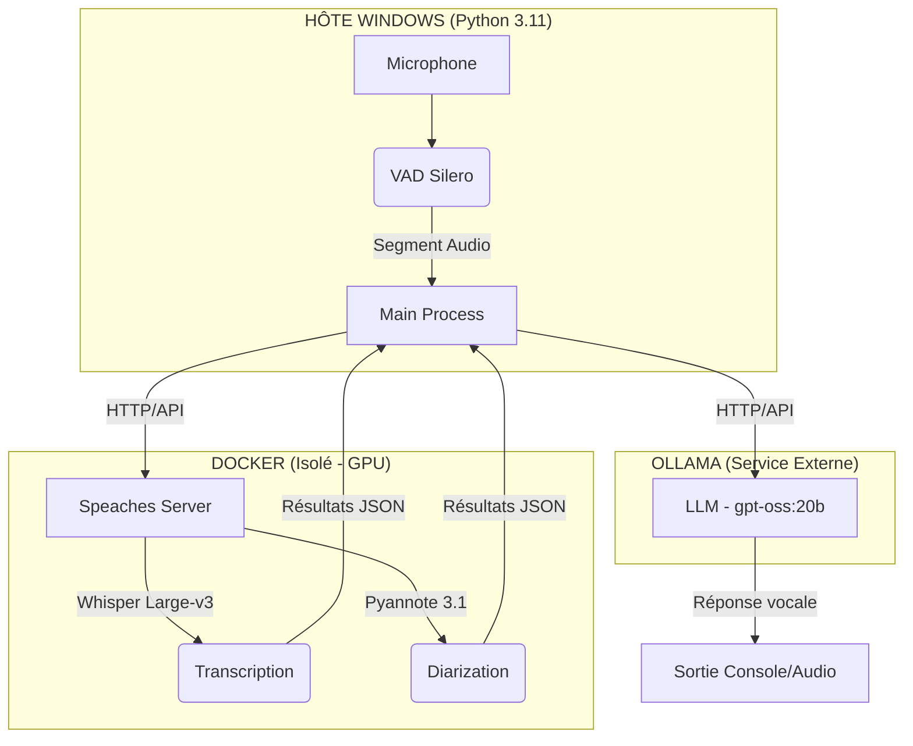

# 🧠 Local AI Voice Assistant (LAVA) - v2.0 (Docker Edition)

Assistant vocal local modulaire utilisant une architecture **Micro-services**. 
L'IA lourde est isolée dans Docker pour garantir une stabilité totale des dépendances.

## 📊 Architecture du Flux



## 🛠️ Pré-requis

*   **OS** : Windows 10/11 avec **Docker Desktop** (WSL2 backend).
*   **GPU** : NVIDIA RTX (drivers à jour).
*   **Outils** : Ollama (installé sur Windows).

## 🚀 Installation Rapide

1.  **Préparer l'environnement Python** :
    ```bash
    python -m venv .venv
    .venv\Scripts\activate
    pip install -r requirements.txt
    ```

2.  **Lancer le moteur IA (Docker)** :
    *   Remplissez votre `HF_TOKEN` dans le fichier `docker-compose.yml`.
    *   Dans un terminal, lancez :
    ```bash
    docker compose up -d
    ```

3.  **Vérifier le serveur** :
    Accédez à [http://localhost:8000/docs](http://localhost:8000/docs). Si la page s'affiche, le moteur est prêt.

## ⚙️ Configuration

*   **Diarisation** : Automatiquement gérée par le serveur Speaches via l'argument `extra_body={"diarization": True}` dans `diarization.py`.
*   **VRAM** : Le modèle `large-v3` consomme environ 5-6 Go de VRAM sur votre GPU via Docker.

## ▶️ Utilisation

1.  Lancer Ollama.
2.  Lancer le conteneur Docker (si pas déjà fait).
3.  Exécuter le programme :
    ```bash
    python main.py
    ```

## 💎 Avantages de la v2.0
*   **Zéro Conflit** : Plus de problème de version NumPy ou de DLL CUDA manquantes.
*   **Performance** : Le modèle Whisper est pré-chargé dans la VRAM par Docker, éliminant la latence de chargement au premier mot.
*   **Portabilité** : Le code Python est devenu un simple client API ultra-léger.


---

### 4. Rappel du fichier `docker-compose.yml` (À placer à la racine)
C'est le fichier qui "sauve" ton projet.

```yaml
services:
  whisper:
    image: ghcr.io/speaches-ai/speaches:latest-cuda
    container_name: whisper-server
    restart: unless-stopped
    ports:
      - "8000:8000"
    volumes:
      - whisper_data:/home/ubuntu/.cache/huggingface
    environment:
      - HF_TOKEN=[Clé HuggingFace]
      - HF_HOME=/home/ubuntu/.cache/huggingface
      - SPEACHES_MODELS_PRELOAD=Systran/faster-whisper-large-v3
      - WHISPER__MODEL=Systran/faster-whisper-large-v3
      - WHISPER__DEVICE=cuda
      - WHISPER__COMPUTE_TYPE=int8_float16
      - WHISPER__NUM_WORKERS=4
    deploy:
      resources:
        reservations:
          devices:
            - driver: nvidia
              count: all
              capabilities: [gpu]

# CETTE SECTION EST OBLIGATOIRE POUR ÉVITER L'ERREUR "UNDEFINED VOLUME"
volumes:
  whisper_data:
```
