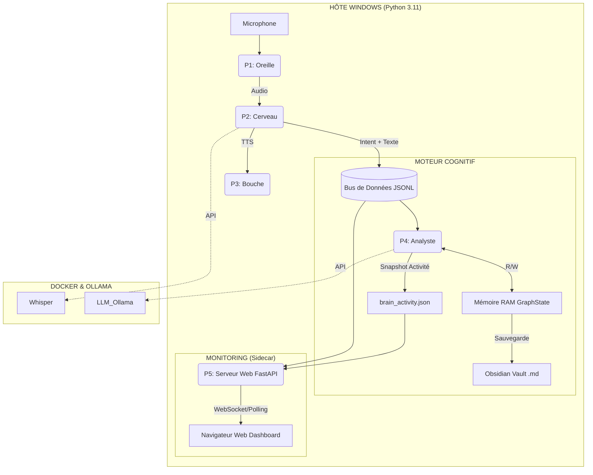

# 🌊 Océane - Assistant de Réflexion Sémantique (v2.5)

Océane est un écosystème multi-agents local conçu pour transformer vos réflexions orales en un **Zettelkasten** structuré.
Cette version introduit une **Architecture Cognitive Hybride** : le système possède une "mémoire de travail" volatile (RAM) qui simule l'attention, et une "mémoire à long terme" persistante (Obsidian)

## 🏗️ Architecture des Agents
1.  **P1: L'Oreille** (Silero VAD) : Découpe le flux audio en segments logiques.
2.  **P2: Le Cerveau** (Whisper + Semantic Router) : Transcrit et identifie les intentions via **Similarité Cosinus**.
3.  **P3: La Bouche** (Edge-TTS) : Restitue des briefings vocaux (Voix: Vivienne).
4.  **P4: L'Analyste** (Moteur Cognitif) :
    *   Gère le **Graphe Mental** en RAM (Poids, Activation, Ignition).
    *   Exécute la **Propagation Top-Down** (l'activation d'un concept réveille ses voisins).
    *   Interroge le **LLM (Mistral/GPT)** pour la synthèse et l'extraction de concepts.
5.  **P5: Le Moniteur** (FastAPI Sidecar) : Un serveur Web dédié qui affiche l'état interne du cerveau en temps réel.

## 🧠 Fonctions Cognitives (Nouveau)
*   **Dynamique d'Attention (ADR-022)** : Chaque note possède une "Barre de Vie" (Activation).
    *   **Ignition 🔥** : Si l'attention dépasse un seuil, la note devient "Consciente" et est envoyée au LLM.
    *   **Fatigue 📉** : Si une note reste active trop longtemps, une pénalité la force à s'éteindre pour laisser place à d'autres sujets.
*   **Propagation Neuronale** : Parler de "Politique" activera doucement les notes liées comme "Éthique" ou "Pouvoir" (Top-Down).
*   **Observabilité Totale (ADR-023)** : Un Dashboard Web (Port 8003) permet de voir :
    *   L'activité neuronale (Jauges d'activation).
    *   Les Prompts bruts envoyés au LLM et ses réponses exactes (Debug).

## 🛠️ Maintenance & Commandes

**Lancement** : Ne lancez plus `python main.py` manuellement. Utilisez le script qui gère le nettoyage des processus et le lancement simultané du serveur Web et du moteur.
1.  Double-cliquez sur **`start_oceane.bat`**.
2.  Deux fenêtres s'ouvrent :
    *   **Le Moteur** : Affiche les logs techniques.
    *   **Le Serveur Web** : Démarre en arrière-plan.
3.  Ouvrez votre navigateur sur : **[http://localhost:8003](http://localhost:8003)** (ou 8002 selon config).

**Arrêt propre** : `python stop.py` (Déclenche l'archivage final et coupe les processus).

## 📊 Architecture du Flux



## 🛠️ Pré-requis

*   **OS** : Windows 10/11.
*   **Outils** : Docker Desktop, Ollama.
*   **Python** : 3.11 avec environnement virtuel (Attention, 3.13 ne fonctionne pas).

## 🚀 Installation Rapide

1.  **Préparer l'environnement Python** :
    ```bash
    python -m venv .venv
    .venv\Scripts\activate
    pip install -r requirements.txt
    ```

2.  **Lancer le moteur IA (Docker)** :
    *   Remplissez votre `HF_TOKEN` dans le fichier `docker-compose.yml`.
    *   Dans un terminal, lancez :
    ```bash
    docker compose up -d
    ```

3.  **Vérifier le serveur** :
    Accédez à [http://localhost:8000/docs](http://localhost:8000/docs). Si la page s'affiche, le moteur est prêt.

## ⚙️ Configuration

*   **Diarisation** : Automatiquement gérée par le serveur Speaches via l'argument `extra_body={"diarization": True}` dans `diarization.py`.
*   **VRAM** : Le modèle `large-v3` consomme environ 5-6 Go de VRAM sur votre GPU via Docker.
*   **Paramètres cognitifs** : Ajustables pour changer la "personnalité" du système.

## ▶️ Utilisation

1.  Lancer Ollama.
2.  Lancer le conteneur Docker (si pas déjà fait).
3.  Double-cliquez sur start_oceane.bat. Deux fenêtres s'ouvrent :
   - Le Moteur : Affiche les logs techniques.
   - Le Serveur Web : Démarre en arrière-plan.
   Ouvrez votre navigateur sur : http://localhost:8002 (ou 8002 selon config).


---

### Rappel du fichier `docker-compose.yml` (À placer à la racine)
C'est le fichier qui "sauve" ton projet.

```yaml
name: Diarisation_Synthese_LLM

services:
  # --- MOTEUR AUDIO (Whisper) ---
  whisper:
    image: ghcr.io/speaches-ai/speaches:latest-cuda
    container_name: whisper-server
    restart: unless-stopped
    ports:
      - "8000:8000"
    volumes:
      - whisper_data:/home/ubuntu/.cache/huggingface
    environment:
      - HF_TOKEN=[CLE API ICI]
      - HF_HOME=/home/ubuntu/.cache/huggingface
      - SPEACHES_MODELS_PRELOAD=Systran/faster-whisper-large-v3
      - WHISPER__MODEL=Systran/faster-whisper-large-v3
      - WHISPER__DEVICE=cuda
      - WHISPER__COMPUTE_TYPE=int8_float16
      - WHISPER__NUM_WORKERS=4
    deploy:
      resources:
        reservations:
          devices:
            - driver: nvidia
              count: all
              capabilities: [gpu]

  # --- LE CERVEAU UNIQUE (Ollama: Nemo + Embeddings) ---
  router-llm:
    image: ollama/ollama:latest
    container_name: LLM-router
    restart: unless-stopped
    ports:
      - "11435:11434"
    volumes:
      - ollama_storage:/root/.ollama
    deploy:
      resources:
        reservations:
          devices:
            - driver: nvidia
              count: all
              capabilities: [gpu]

  # --- LA MÉMOIRE VECTORIELLE (ChromaDB) ---
  chromadb:
    image: ghcr.io/chroma-core/chroma:latest
    container_name: chromadb-server
    restart: unless-stopped
    ports:
      - "8001:8000"
    volumes:
      - chroma_data:/chroma/chroma # Volume persistant pour le RAG
    environment:
      - IS_PERSISTENT=TRUE
      - ANONYMIZED_TELEMETRY=FALSE

volumes:
  whisper_data:
  ollama_storage:
  chroma_data:
```
