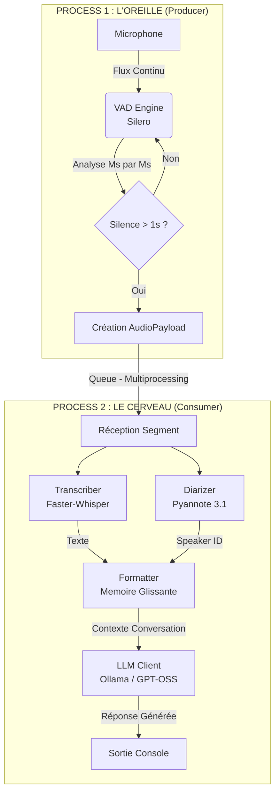

# 🧠 Local AI Voice Assistant (LAVA)

Un assistant vocal entièrement local, modulaire et respectueux de la vie privée.
Il combine reconnaissance vocale (Whisper), identification des locuteurs (Pyannote) et intelligence conversationnelle (LLM via Ollama), le tout orchestré en Python via multiprocessing.

## 📊 Architecture du Flux de Données

Le système suit une architecture **Producer-Consumer** pour garantir qu'aucune donnée audio n'est perdue pendant que l'IA réfléchit.



## 🛠️ Pré-requis Techniques

*   **OS** : Windows 10/11 (Recommandé avec GPU NVIDIA)
*   **Python** : Version **3.10** à **3.12** (3.13 non supporté par PyTorch actuellement)
*   **GPU** : NVIDIA avec 8GB+ VRAM recommandés (Testé sur RTX 4060 Ti 16GB)
*   **Outils Externes** : 
    *   [Ollama](https://ollama.com/) installé et tournant en tâche de fond.

## 🚀 Installation (Windows / NVIDIA)

L'installation de PyTorch avec support CUDA est délicate. Suivez cet ordre précis :

1.  **Créer un environnement virtuel** :
    ```bash
    python -m venv .venv
    .venv\Scripts\activate
    ```

2.  **Installer le socle PyTorch (CRITIQUE)** :
    *Ceci garantit l'utilisation du GPU. Ne sautez pas cette étape.*
    ```bash
    pip install torch torchvision torchaudio --index-url https://download.pytorch.org/whl/cu121
    ```

3.  **Installer les bibliothèques NVIDIA (Correctif DLL)** :
    ```bash
    pip install nvidia-cudnn-cu12 nvidia-cublas-cu12
    ```

4.  **Installer le reste des dépendances** :
    ```bash
    pip install -r requirements.txt
    ```

5.  **Configuration** :
    *   Dupliquez le fichier `.env.example` en `.env`.
    *   Ajoutez votre token Hugging Face (nécessaire pour Pyannote) : `HF_TOKEN=hf_...`
    *   Acceptez les conditions d'utilisation de [Pyannote Segmentation](https://huggingface.co/pyannote/segmentation-3.0) et [Speaker Diarization](https://huggingface.co/pyannote/speaker-diarization-3.1) sur Hugging Face.

## ⚙️ Configuration (`config.py`)

Vous pouvez ajuster le comportement de l'assistant dans `config.py` :
*   `VAD_MIN_SILENCE_DURATION_MS` : Ajuste la "patience" de l'écoute (défaut : 1000ms).
*   `SPEAKER_MAPPING` : Renomme `SPEAKER_00` en "Utilisateur" ou "Gérald".
*   `LLM_MODEL_NAME` : Change le modèle utilisé par Ollama (ex: `mistral`, `llama3`, `gpt-oss:20b`).

## ▶️ Utilisation

1.  Assurez-vous qu'Ollama est lancé : `ollama serve`
2.  Lancez le programme principal :
    ```bash
    python main.py
    ```
3.  Parlez dans le micro. Appuyez sur `Ctrl+C` pour arrêter.

## 🧪 Tests Unitaires

*   `test_step_1.py` : Teste uniquement le micro et la détection de voix (VAD). Sauvegarde les wav dans `test_segments/`.
*   `test_step_2.py` : Teste la chaîne IA (Whisper + Diarization) sur un fichier enregistré.
```